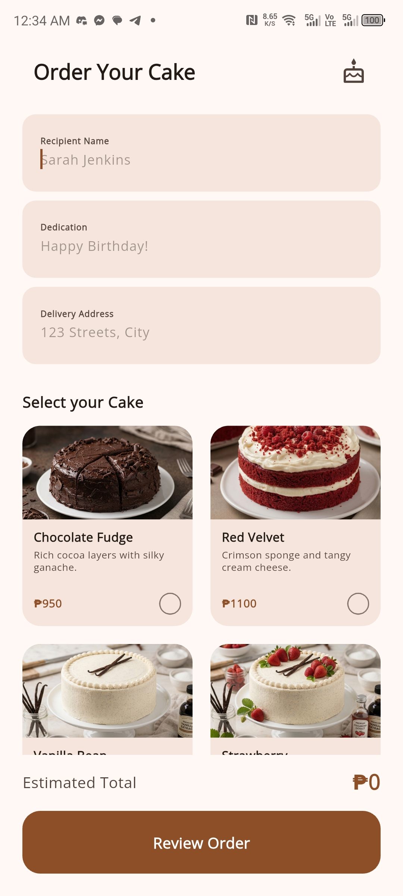
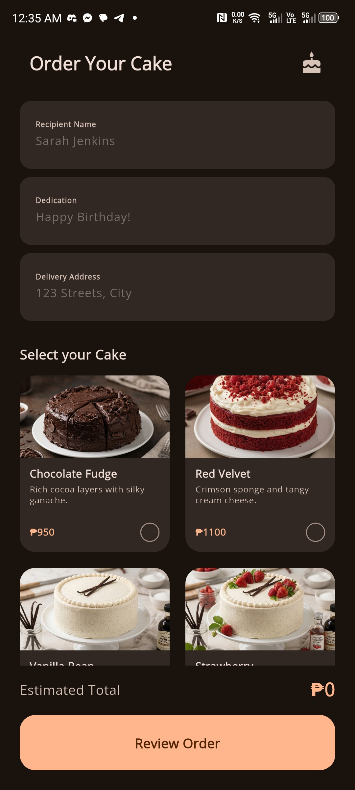

# MiniOrderingApp

## Showcase

| Light | Dark |
| :---: | :---: |
|  |  |

When I first approached the Flutter framework, the distinction between `StatelessWidget` and `StatefulWidget` felt like a redundant design. If both classes eventually produce the same pixels on a screen, why does the framework demand two entirely different ways to define them?

The answer lies not in what the widgets **are**, but in how the **Flutter Engine manages memory and lifecycle** to maintain a consistent 60FPS (or 120FPS) performance.

## The Trees

To understand Flutter’s efficiency, we must recognize that the "Widget Tree" we write in Dart is only the surface layer. The framework simultaneously manages three distinct data structures (trees) that work with each other.

1. **The Widget Tree (Configuration):**
Widgets are **immutable configurations**. They are "value-type (Stack-Allocated)" objects that are extremely lightweight. In the Dart VM, allocating a widget is a low-cost operation. Because they are immutable, they cannot be modified; they are simply destroyed and recreated every time a change is requested.
2. **The Element Tree (Lifecycle/Manager):**
The **Element** is the controller. Unlike widgets, Elements are **persistent**. An element lives in memory as long as its position in the UI hierarchy remains logically the same. It holds the reference to the widget and coordinates updates.
3. **The RenderObject Tree (Painting/Layout):**
It handles the actual geometry, constraints, and painting of pixels to the screen. Creating a RenderObject is "expensive" in terms of CPU and memory because it involves complex math and interaction with the GPU via the rendering backend (Impeller or Skia).

## Stateless vs. StatefulWidget

My misunderstanding is that a `StatefulWidget` "contains" state. It does not. Like its stateless counterpart, a `StatefulWidget` is an immutable blueprint that is discarded and rebuilt constantly.

The persistence of state in this case is achieved via Memory Referencing the State object.

## The Role of the `State` Object

When a `StatefulWidget` is inserted into the tree, the framework calls `createState()`. This allocates a `State` object on the heap. Crucially, the **StatefulElement** (in the Element Tree) holds a persistent **memory reference** to this `State` object.

* **Stateless:** When a rebuild occurs, the Element replaces its old widget reference with a new one.
* **Stateful:** When a rebuild occurs, the widget instance is replaced, but the `StatefulElement` maintains the same reference to the `State` object. This allows variables (like user input, scroll positions, or animations) to survive even though the widget that originally described them has been destroyed and garbage collected.

The `StatefulWidget` acts as a **factory** and a **key-holder**, ensuring the runtime knows exactly which persistent data belongs to which part of the UI.

## Diffing Algorithm

Flutter avoids the "brute force" approach of redrawing the entire screen by using a **Reconciliation (Diffing) Algorithm**. This happens during the transition from the Widget Tree to the Element Tree.

When `setState()` is called, the framework marks an Element as "dirty." During the next frame, it compares the **Old Widget** with the **New Widget** at that specific location using the `Widget.canUpdate` method:

```dart
static bool canUpdate(Widget oldWidget, Widget newWidget) {
  return oldWidget.runtimeType == newWidget.runtimeType 
      && oldWidget.key == newWidget.key;
}

```

### How the Algorithm Orchestrates the Trees

1. **Match Found:** If the `runtimeType` and `key` match, the Element stays alive. It simply updates its internal reference to the new Widget. It then calculates the "Delta" (the difference).
2. **Surgical Update:** If only a small property changed (e.g., a text color), the Element tells the **RenderObject**: *"Don't re-calculate the layout, just repaint this specific area with the new color."*
3. **No Match:** If the type changes (e.g., a `Text` is replaced by an `Image`), the Element and its associated RenderObject are destroyed, and a new sub-tree is mounted.

## Why This Architecture Guarantees Performance

This approach is specifically designed to solve the bottlenecks of traditional UI frameworks.

* Even if the UI has thousands of widgets, the diffing algorithm allows Flutter to "short-circuit" the process. If a branch of the tree hasn't changed, the framework skips it entirely, never touching the expensive RenderObjects.
* By making Widgets immutable and short-lived, Flutter leverages Dart’s **Generational Garbage Collector**, which is highly optimized for cleaning up thousands of small, short-lived objects without causing "jank" (stutter).
* The most expensive operation in any UI is "Layout" (figuring out where things go). By separating the **Blueprint (Widget)** from the **Geometry (RenderObject)**, Flutter ensures that we only recalculate positions when absolutely necessary, keeping the app at a fluid 60FPS even on low-end hardware.
